<h2>TensorFlow-FlexUNet-Image-Segmentation-Multiclass-BraTS2023-Subset (2025/11/27)</h2>
<!--
<h3>Revisiting The Brain Tumor Segmentation (BraTS) Challenge 2023: Glioma Segmentation ...</h3>
-->
Toshiyuki Arai 
Software Laboratory antillia.com 
 
This is the first experiment of Image Segmentation for Multiclass Brain Tumor 2023 (BraTS2023),
 based on our 
TensorFlowFlexUNet (TensorFlow Flexible UNet Image Segmentation Model for Multiclass) 
and a 256x256 pixels PNG 
<a href="https://drive.google.com/file/d/1UEeggR2yYAk3ZjXdGB48oXHM8cWiDrfb/view?usp=sharing">
BraTS2023-Subset-ImageMask-Dataset.zip
</a> with colorized masks, 
which was derived by us from    

<a href="https://www.kaggle.com/datasets/aiocta/brats2023-part-1/data">
BRATS2023_PART_1
</a>  on the kaggle web site 
 
 

<b>Acutual Image Segmentation for 256x256 pixels Brain Tumor</b> 
As shown below, the inferred masks predicted by our segmentation model trained on the 
PNG dataset appear similar to the ground truth masks, but they lack precision in certain areas. 
<b>rgb_map (WT:blue, TC:green,   ET:red ) </b>
 
<table>
<tr>
<th>Input: image</th>
<th>Mask (ground_truth)</th>
<th>Prediction: inferred_mask</th>
</tr>
<tr>
<td>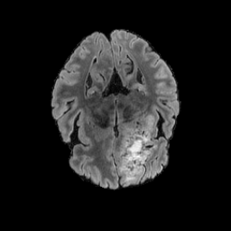</td>
<td>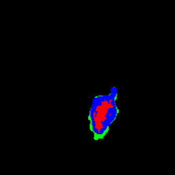</td>
<td>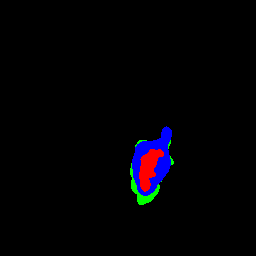</td>
</tr>
<tr>
<td>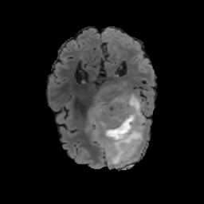</td>
<td>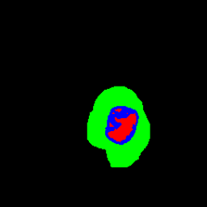</td>
<td>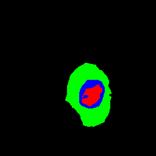</td>
</tr>
<tr>
<td>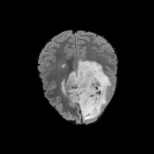</td>
<td>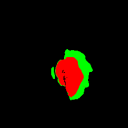</td>
<td></td>
</tr>
</table>

<h3>1. Dataset Citation</h3>
The dataset used here was derived from    
 <a href="https://www.kaggle.com/datasets/aiocta/brats2023-part-1/data">
BRATS2023_PART_1
</a> on the kaggle web site
  
The following description on BraTS23 was taken from the web site:  
<a href="https://www.synapse.org/Synapse:syn51156910/wiki/621282">BraTS 2023 Challenge</a>
 
 
The International Brain Tumor Segmentation (BraTS) challenge. BraTS, since 2012, has focused on the generation of 
a benchmarking environment and dataset for the delineation of adult brain gliomas.   
The focus of this year’s challenge remains the generation of a common benchmarking environment, but its dataset 
is substantially expanded to ~4,500 cases towards addressing additional  
i) populations (e.g., sub-Saharan Africa patients),  
ii)tumors (e.g., meningioma),  
iii) clinical concerns (e.g., missing data), and  
iv) technical considerations (e.g., augmentations).  
 
Specifically, the focus of BraTS 2023 is to identify the current state-of-the-art algorithms for addressing (Task 1) 
the same adult glioma population as in the RSNA-ANSR-MICCAI BraTS challenge, as well as (Task 2) 
the underserved sub-Saharan African brain glioma patient population, (Task 3) intracranial meningioma, 
(Task 4) brain metastasis, (Task 5) pediatric brain tumor patients, (Tasks 7 & 8) global & local missing data, 
(Task 9) useful augmentation techniques, and importantly (Task 6) the algorithmic generalizability across Tasks 1-5. 
Details for each ‘Task’ are listed in the rest of this documents under
 
<a href="https://www.synapse.org/Synapse:syn51156910/wiki/622341">Challenges</a>

 
 
For more information, please refer to <a href="https://pmc.ncbi.nlm.nih.gov/articles/PMC10312814/">
<b>
The Brain Tumor Segmentation (BraTS) Challenge 2023: Glioma Segmentation in Sub-Saharan Africa Patient Population (BraTS-Africa)</a>
</b>
 
 
<h3>
<a id="2">
2 BraTS2023 ImageMask Dataset
</a>
</h3>
<h4>2.1 Download ImageMask Dataset</h4>
 If you would like to train this BraTS2023 Segmentation model by yourself,
 please download the dataset from the google drive 
<a href="https://drive.google.com/file/d/1UEeggR2yYAk3ZjXdGB48oXHM8cWiDrfb/view?usp=sharing">
BraTS2023-Subset-ImageMask-Dataset.zip</a> , expand the downloaded dataset, and put it under <b>./dataset</b> folder to be
<pre>
./dataset
└─BraTS2023
    ├─test
    │   ├─images
    │   └─masks
    ├─train
    │   ├─images
    │   └─masks
    └─valid
        ├─images
        └─masks
</pre>
 
<b>BraTS2023 Statistics</b> 
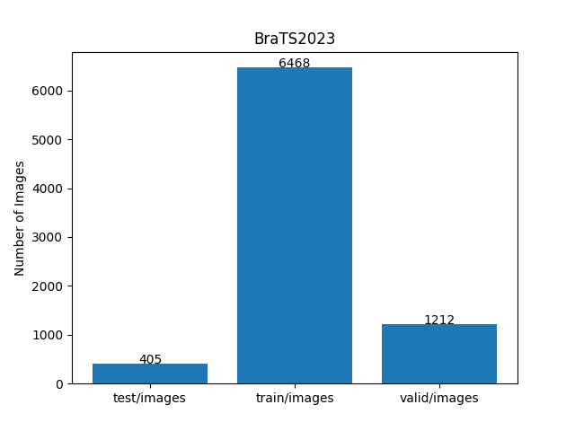 
 
As shown above, the number of images of train and valid datasets is large enough to use for a training set of our segmentation model.
 
 
<h4>2.2 ImageMask Dataset Derivation</h4>
The folder structure of BRATS2023_TASK_1 is the following. 
<pre>
./BRATS2023_TASK_1
  ├─BraTS-GLI-00000-000
  │  ├─BraTS-GLI-00000-000-seg.nii
  │  ├─BraTS-GLI-00000-000-t1c.nii
  │  ├─BraTS-GLI-00000-000-t1n.nii
  │  ├─BraTS-GLI-00000-000-t2f.nii
  │  └─BraTS-GLI-00000-000-t2w.nii
...
  ├─BraTS-GLI-00002-000
...
  └─BraTS-GLI-00739-000
      ├─BraTS-GLI-00739-000-seg.nii
      ├─BraTS-GLI-00739-000-t1c.nii
      ├─BraTS-GLI-00739-000-t1n.nii
      ├─BraTS-GLI-00739-000-t2f.nii
      └─BraTS-GLI-00739-000-t2w.nii
</pre>
We used <b>*_seg.nii</b> and <b>*_t2f.nii</b> files under 
<b>./BRATS2023_TASK_1/BraTS-GLI-*/</b> folders to generate our PNG dataset. 
However, <b>BRATS2023_TASK_1</b> contains 625 sub folders, which are too large to use for our experiment.
Hence, for simplicity and demonstration purposes, we generated our BraTS23 Subset by using one fifth of the original one.
 
We used the following two Python scripts to generate the dataset with colorized masks. 
<ul>
<li><a href="./generator/ImageMaskDatasetGenerator.py">ImageMaskDatasetGenerator.py</a></li>
<li><a href="./generator/split_master.py">split_master.py</a></li>
</ul>
We excluded all empty black masks and their corresponding images to generate our PNG dataset,
which were irrelevant to train our segmentation model, and resized all images and masks to 256x256 pixels.
We also used the following category and color mapping table to generate the colorized masks.
 
 
<table border="1" style="border-collapse: collapse;">

<tr><th>Index</th><th>Category</th><th>Color </th><th>BGR triplet</th></tr>
<tr>
<td>1</td><td>WT (Whole Tumor)</td><td>blue</td><td>(255,0,0)</td><tr>
<td>2</td><td>TC (Tumor Core)</td><td>green</td><td>(0,255,0)</td><tr>
<td>3</td><td>ET (Enhancing Tumor)</td><td>red</td><td>(0,0,255)</td><tr>
</table>
 

<h4>2.3 Image and Mask samples</h4>
<b>Train_images_sample</b> 
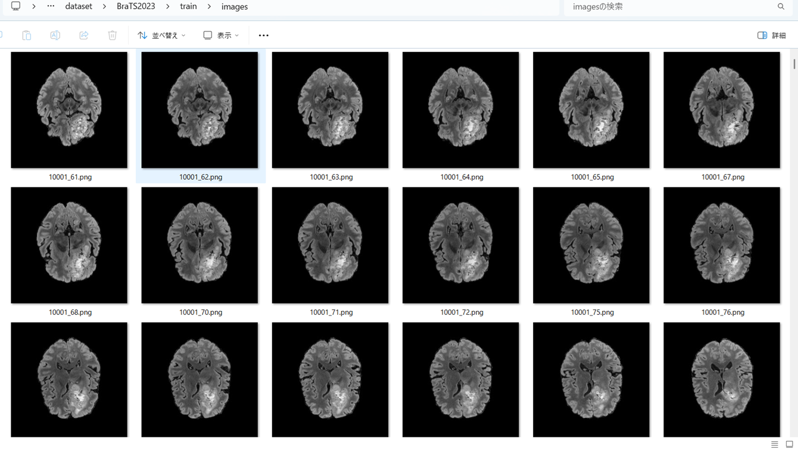
 
<b>Train_masks_sample</b> 
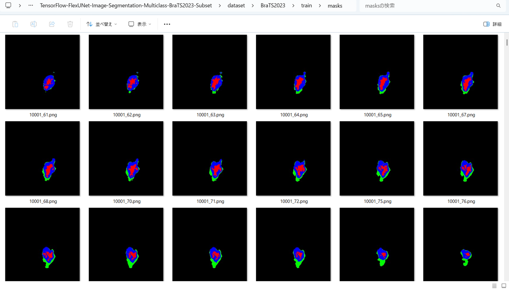
 
 
<h3>
3 Train TensorFlowFlexUNet Model
</h3>
 We trained BraTS2023 TensorFlowFlexUNet Model by using the following
<a href="./projects/TensorFlowFlexUNet/BraTS2023/train_eval_infer.config"> <b>train_eval_infer.config</b></a> file.  
Please move to ./projects/TensorFlowFlexUNet/BraTS2023 and run the following bat file. 
<pre>
>1.train.bat
</pre>
, which simply runs the following command. 
<pre>
>python ../../../src/TensorFlowFlexUNetTrainer.py ./train_eval_infer.config
</pre>

<b>Model parameters</b> 
Defined a small <b>base_filters = 16 </b> and large <b>base_kernels = (7,7)</b> for the first Conv Layer of Encoder Block of 
<a href="./src/TensorFlowFlexUNet.py">TensorFlowFlexUNet.py</a> 
and a large num_layers (including a bridge between Encoder and Decoder Blocks).
<pre>
[model]
;You may specify your own UNet class derived from our TensorFlowFlexModel
model         = "TensorFlowFlexUNet"
generator     =  False
image_width    = 256
image_height   = 256
image_channels = 3
num_classes    = 4

base_filters   = 16
base_kernels   = (7,7)
num_layers     = 8
dropout_rate   = 0.05
dilation       = (1,1)
</pre>
<b>Learning rate</b> 
Defined a very small learning rate.  
<pre>
[model]
learning_rate  = 0.00007
</pre>
<b>Loss and metrics functions</b> 
Specified "categorical_crossentropy" and <a href="./src/dice_coef_multiclass.py">"dice_coef_multiclass"</a>. 
<pre>
[model]
loss           = "categorical_crossentropy"
metrics        = ["dice_coef_multiclass"]
</pre>
<b>Dataset class</b> 
Specifed <a href="./src/ImageCategorizedMaskDataset.py">ImageCategorizedMaskDataset</a> class. 
<pre>
[dataset]
class_name    = "ImageCategorizedMaskDataset"
</pre>
 
<b>Learning rate reducer callback</b> 
Enabled learing_rate_reducer callback, and a small reducer_patience.
<pre> 
[train]
learning_rate_reducer = True
reducer_factor     = 0.5
reducer_patience   = 4
</pre>
<b>Early stopping callback</b> 
Enabled early stopping callback with patience parameter.
<pre>
[train]
patience      = 10
</pre>

<b>RGB Color map</b> 
rgb color map dict for BraTS2023 1+3 classes. 
<pre>
[mask]
;l WT (Whole Tumor)
;2 TC (Tumor Core)
;3 ET (Enhancing Tumor)
;                   WT:blue, TC:green,   ET:red
rgb_map = {(0,0,0):0,(0,0,255):1,(0,255,0):2, (255,0,0):3, }
</pre>

<b>Epoch change inference callback</b> 
Enabled <a href="./src/EpochChangeInfereuncer.py">epoch_change_infer callback</a></b>. 
<pre>
[train]
epoch_change_infer       = True
epoch_change_infer_dir   =  "./epoch_change_infer"
num_infer_images         = 6
</pre>

By using this callback, on every epoch_change, the inference procedure can be called
 for 6 images in <b>mini_test</b> folder. This will help you confirm how the predicted mask changes 
 at each epoch during your training process.    

<b>Epoch_change_inference output at starting (epoch 1,2,3)</b> 
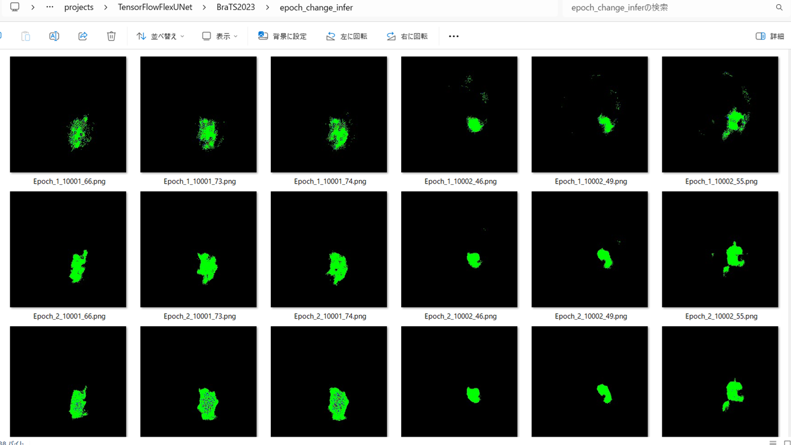 
 
<b>Epoch_change_inference output at middlepoint (epoch 33,34,35)</b> 
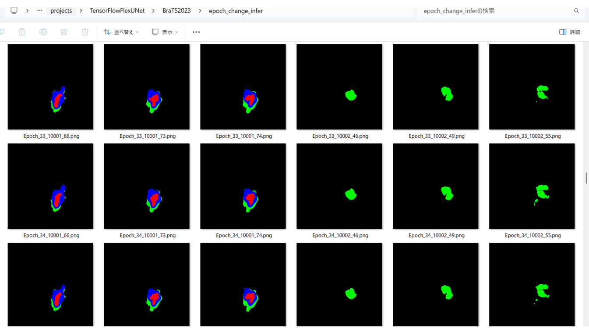 
 
<b>Epoch_change_inference output at ending (epoch 68,69,70)</b> 
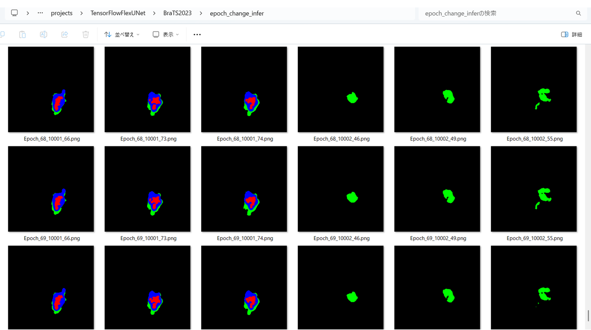 
 
In this experiment, the training process was terminated at epoch 70.  
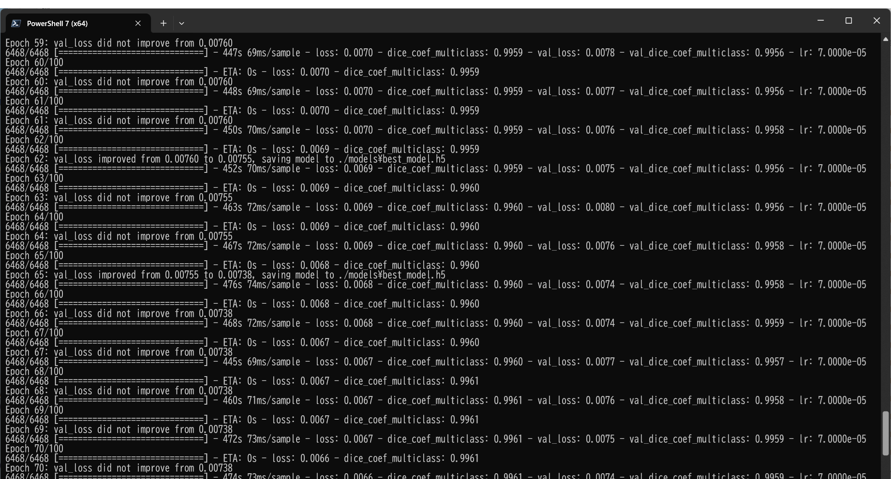 
 

<a href="./projects/TensorFlowFlexUNet/BraTS2023/eval/train_metrics.csv">train_metrics.csv</a> 
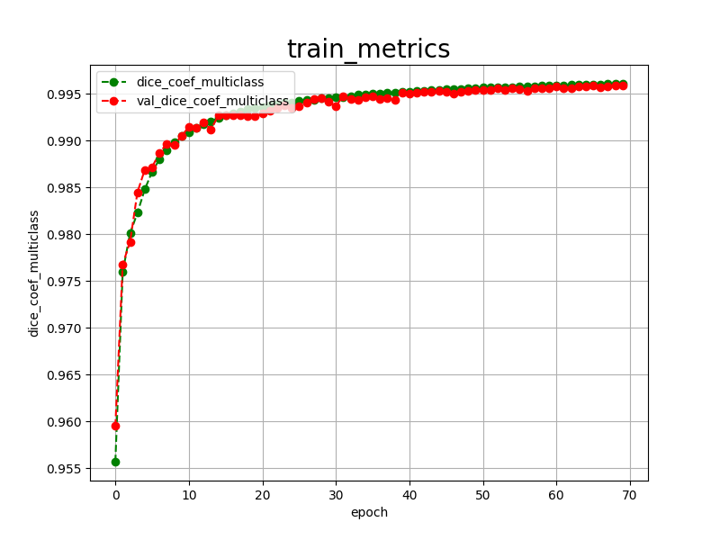 

 
<a href="./projects/TensorFlowFlexUNet/BraTS2023/eval/train_losses.csv">train_losses.csv</a> 
 

 
<h3>
4 Evaluation
</h3>
Please move to <b>./projects/TensorFlowFlexUNet/BraTS2023</b> folder, 
and run the following bat file to evaluate TensorFlowFlexUNet model for BraTS2023. 
<pre>
./2.evaluate.bat
</pre>
This bat file simply runs the following command.
<pre>
python ../../../src/TensorFlowFlexUNetEvaluator.py ./train_eval_infer.config
</pre>

Evaluation console output: 
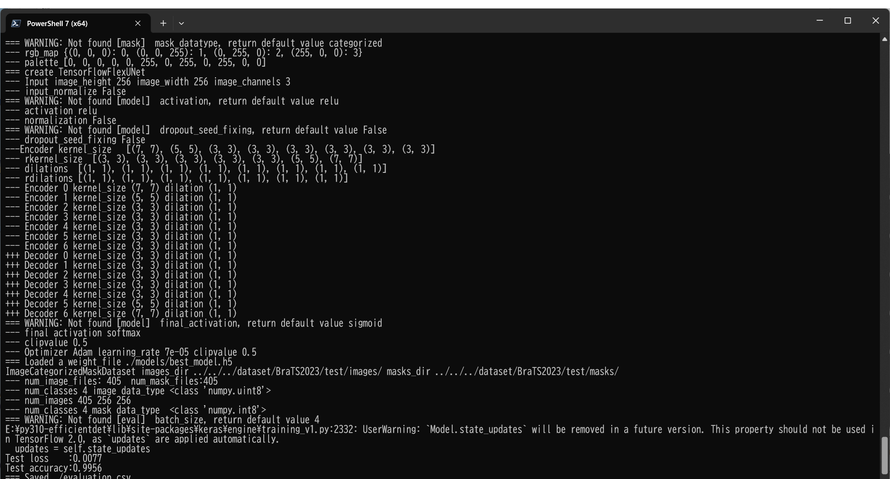
  

<a href="./projects/TensorFlowFlexUNet/BraTS2023/evaluation.csv">evaluation.csv</a> 
The loss (categorical_crossentropy) to this BraTS2023/test was very low, and dice_coef_multiclass very high as shown below.
 
<pre>
categorical_crossentropy,0.0077
dice_coef_multiclass,0.9956
</pre>
 

<h3>
5 Inference
</h3>
Please move <b>./projects/TensorFlowFlexUNet/BraTS2023</b> folder 
,and run the following bat file to infer segmentation regions for images by the Trained-TensorFlowFlexUNet model for BraTS2023. 
<pre>
./3.infer.bat
</pre>
This simply runs the following command.
<pre>
python ../../../src/TensorFlowFlexUNetInferencer.py ./train_eval_infer.config
</pre>

<b>mini_test_images</b> 
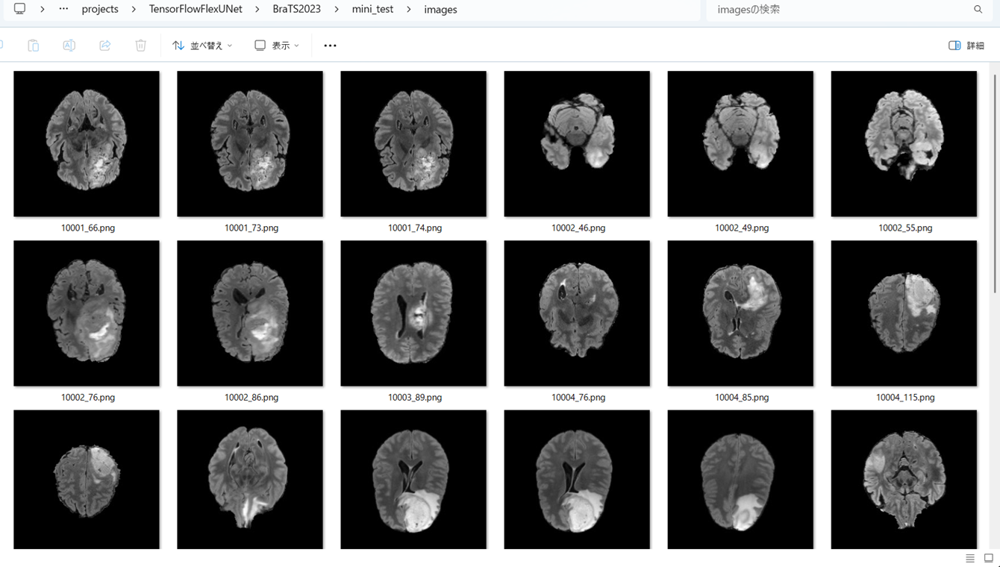 
<b>mini_test_mask(ground_truth)</b> 
 

<b>Inferred test masks</b> 
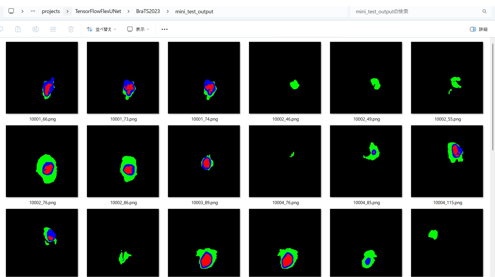 
 

<b>Enlarged images and masks of 256x256 pixels Brain Tumor</b> 
As shown below, the inferred masks predicted by our segmentation model trained on the 
PNG dataset appear similar to the ground truth masks, but they lack precision in certain areas. 
<b>rgb_map ( WT:blue, TC:green,   ET:red)</b> 
<table>
<tr>
<th>Image</th>
<th>Mask (ground_truth)</th>
<th>Inferred-mask</th>
</tr>

<tr>
<td>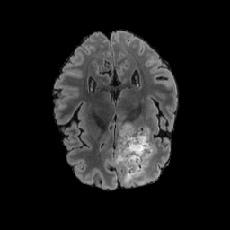</td>
<td>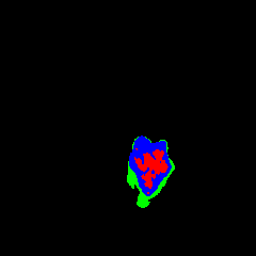</td>
<td>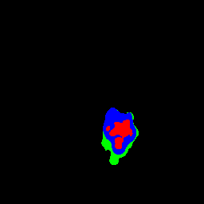</td>
</tr>

<tr>
<td></td>
<td></td>
<td></td>
</tr>

<tr>
<td>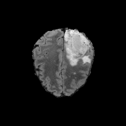</td>
<td>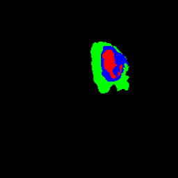</td>
<td></td>
</tr>

<tr>
<td>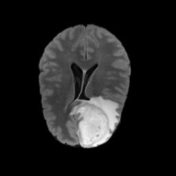</td>
<td>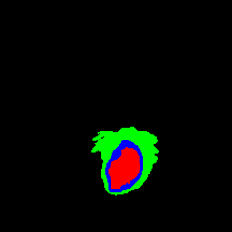</td>
<td></td>
</tr>

<tr>
<td></td>
<td></td>
<td></td>
</tr>

<tr>
<td>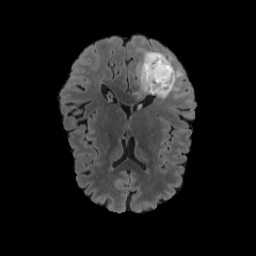</td>
<td></td>
<td>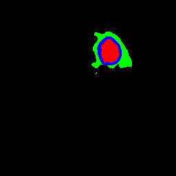</td>
</tr>
</table>

 
<h3>
References
</h3>
<b>1. Multi-class glioma segmentation on real-world data with missing MRI sequences: comparison of three deep learning algorithms
</b> 
Hugh G. Pemberton, Jiaming Wu, Ivar Kommers, Domenique M. J. Müller, Yipeng Hu, Olivia Goodkin,  
Sjoerd B. Vos, Sotirios Bisdas, Pierre A. Robe, Hilko Ardon, Lorenzo Bello, Marco Rossi,  
Tommaso Sciortino, Marco Conti Nibali, Mitchel S. Berger, Shawn L. Hervey-Jumper, Wim Bouwknegt, 
 Wimar A. Van den Brink, Julia Furtner, Seunggu J. Han, Albert J. S. Idema, Barbara Kiesel, 
  Georg Widhalm, Alfred Kloet, Michiel Wagemakers, Aeilko H. Zwinderman, Sandro M. Krieg,  
  Emmanuel Mandonnet, Ferran Prados, Philip de Witt Hamer, Frederik Barkhof & Roelant S. Eijgelaar 
<a href="https://www.nature.com/articles/s41598-023-44794-0">
https://www.nature.com/articles/s41598-023-44794-0
</a>
 
 
<b>2. TensorFlow-FlexUNet-Image-Segmentation-Model</b> 
Toshiyuki Arai antillia.com 
<a href="https://github.com/sarah-antillia/TensorFlow-FlexUNet-Image-Segmentation-Model">
https://github.com/sarah-antillia/TensorFlow-FlexUNet-Image-Segmentation-Model
</a>
 
 
<b>3. TensorFlow-FlexUNet-Image-Segmentation-Multiclass-BraTS2020</b> 
Toshiyuki Arai antillia.com 
<a href="https://github.com/sarah-antillia/TensorFlow-FlexUNet-Image-Segmentation-Multiclass-BraTS2020">
https://github.com/sarah-antillia/TensorFlow-FlexUNet-Image-Segmentation-Multiclass-BraTS2020
</a>

